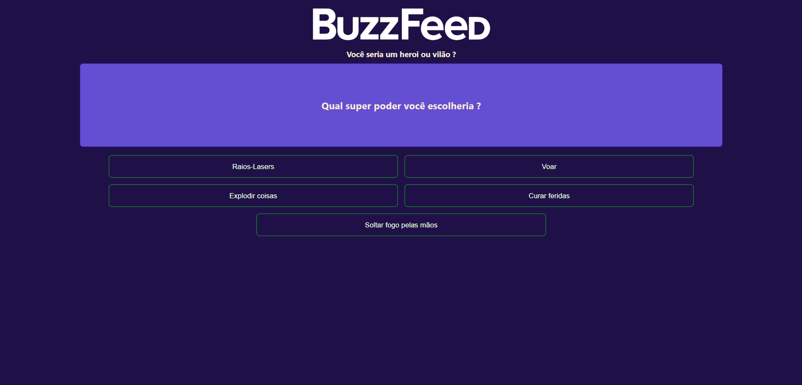

<h1 align="center"> Clone de Quizz Buzzfeed </h1>

  <a href="#-tecnologias">Tecnologias</a>&nbsp;&nbsp;&nbsp;|&nbsp;&nbsp;&nbsp;
  <a href="#-projeto">Projeto</a>&nbsp;&nbsp;&nbsp;

 

  

## 🚀 Tecnologias

Esse projeto foi desenvolvido com as seguintes tecnologias:

- HTML e CSS
- JavaScript, Typescript e JSON
- [Node e NPM](https://nodejs.org/)
- [Angular](https://angular.io/)

## 💻 Projeto

Desenvolvido a partir de aula prática para o Bootcam NTT Data Diversidade em Tech, disponibilizado através da [Dio.\_](https://www.dio.me/), este projeto simula os famosos testes que a empresa norte-americana de mídia de notícias BuzzFeed disponibiliza em suas plataformas e redes sociais. Neste teste, é possível selecionar as suas alternativas preferidas e receber uma resposta se você seria um vilão ou herói!
